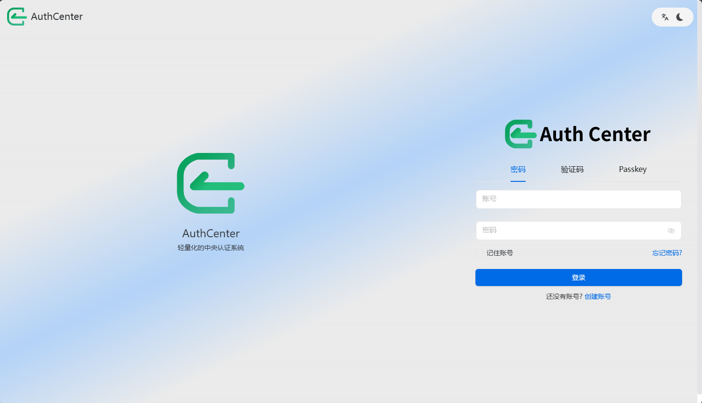
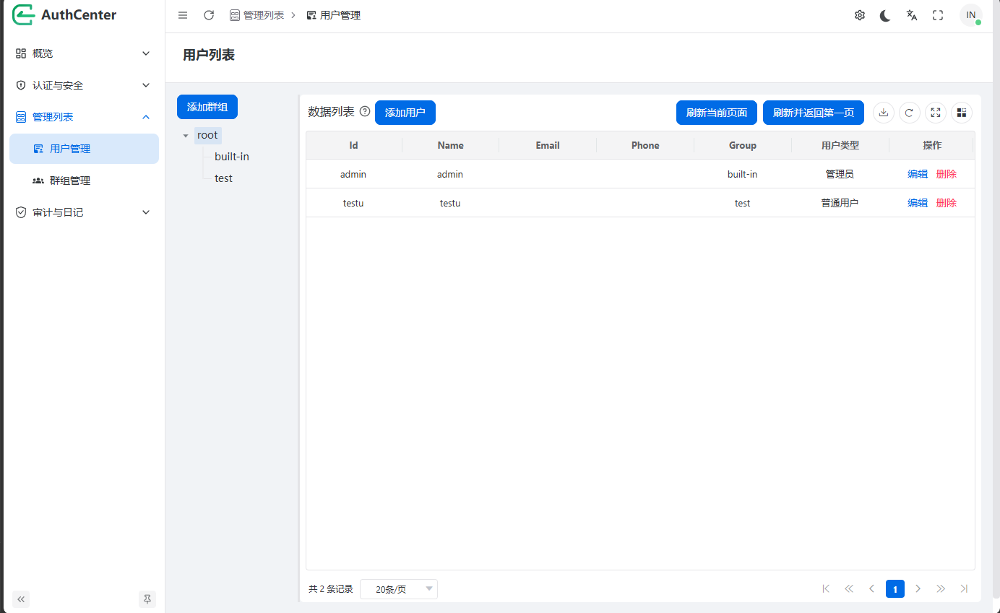

<div align="center">
  <a>
    
  </a>
  <h1>HuiPass</h1>
  <p>
    一个自托管、多协议的身份认证与访问管理平台，基于 .NET 10 和 PostgreSQL 构建。
  </p>
</div>

---

[English](./README.md)

## 项目简介

HuiPass 是一个统一的认证服务器，为你的所有应用集中管理用户身份、单点登录和访问控制。它支持 **OAuth 2.0**、**OpenID Connect (OIDC)**、**SAML 2.0** 和 **CAS** 协议——无论你是在保护现代 SPA 应用、传统企业系统还是内部工具，都可以通过一个平台完成管理。

### 核心功能

- **单点登录** — 一次登录即可访问所有已连接的应用。HuiPass 既可以作为身份提供者，也可以作为联邦代理，对接外部的 OAuth 2.0 / OIDC / SAML 提供者。
- **多协议支持** — 开箱即用地支持 OAuth 2.0 授权码流程、OpenID Connect（含 Discovery）、SAML 2.0 SP-initiated SSO 以及 CAS 服务票据。
- **多种登录方式** — 支持密码登录（BCrypt 加密）、FIDO2/WebAuthn 无密码登录（通行密钥）、TOTP 动态验证码、邮箱验证码以及短信验证码等多种认证方式。
- **多因素认证** — 可灵活配置每个应用的 MFA 策略，支持 TOTP、邮箱和手机三种第二因素验证。
- **应用管理** — 注册任意数量的客户端应用，支持独立的作用域、回调地址、Token 有效期，以及完全可自定义的登录页品牌样式（Logo、主题色、圆角、表单布局等）。
- **用户与群组管理** — 完整的用户生命周期管理，支持基于群组的访问控制。可通过 Excel 进行批量导入/导出。
- **第三方身份集成** — 支持配置外部 OAuth 2.0、OIDC 和 SAML 身份提供者，实现联邦认证。
- **审计日志** — 追踪平台上的所有认证事件。
- **验证码集成** — 内置支持多种验证码服务：hCaptcha、reCAPTCHA v2、Cloudflare Turnstile、阿里云验证码、腾讯验证码。
- **短信与邮件** — 支持通过 Twilio、腾讯云短信或 SMTP（MailKit）发送验证码。
- **文件存储后端** — 支持本地文件系统或 AWS S3 存储头像、Logo 和上传文件。
- **限流保护** — 内置登录频率限制和用户操作频率限制，有效防止暴力破解。

---

## 演示图片






## 技术栈

| 层级 | 技术 |
|------|------|
| 运行时 | .NET 10 (ASP.NET Core) |
| 数据库 | PostgreSQL（通过 Entity Framework Core） |
| 缓存 / 会话 | Redis |
| 前端框架 | Vue 3 + Naive UI |
| 前端构建 | Vite + pnpm (Monorepo) |
| 容器化 | Docker & Docker Compose |
| 密码加密 | BCrypt |
| JWT 认证 | JWT + Microsoft IdentityModel |
| FIDO2/WebAuthn | Fido2.NET |
| TOTP | Otp.NET |
| 文档阅读 | OpenXml + NPOI |
| 图片处理 | SkiaSharp |

---

## 项目结构

```
AuthCenter/
├── Controllers/          # API 控制器
│   ├── ApplicationController.cs   # 应用管理
│   ├── AuditLoggingController.cs  # 审计日志
│   ├── AuthController.cs          # 用户认证（登录/注册/MFA）
│   ├── CaptchaController.cs       # 验证码获取
│   ├── CasController.cs           # CAS 协议
│   ├── CertController.cs          # 证书管理
│   ├── Fido2Controller.cs         # FIDO2/WebAuthn 通行密钥
│   ├── GroupController.cs         # 群组管理
│   ├── MfaController.cs           # 多因素认证管理
│   ├── OAuthController.cs         # OAuth 2.0 / OIDC
│   ├── ProviderController.cs      # 第三方身份提供者
│   ├── SamlController.cs          # SAML 2.0
│   ├── UserController.cs          # 用户管理
│   └── WellKnowController.cs      # OIDC Discovery
├── Models/               # 数据模型
│   ├── Application.cs     # 应用/客户端模型
│   ├── Cert.cs            # 证书模型
│   ├── Group.cs           # 群组模型
│   ├── Provider.cs        # 第三方身份提供者模型
│   ├── User.cs            # 用户模型
│   ├── UserSession.cs     # 用户会话模型
│   └── WebAuthnCredential.cs  # WebAuthn 凭证
├── Providers/            # 可插拔提供者
│   ├── IdProvider/        # 身份提供者（OAuth2、OIDC、SAML）
│   ├── SMSProvider/       # 短信提供者（Twilio、腾讯云）
│   └── StorageProvider/   # 存储提供者（本地、S3）
├── Captcha/              # 验证码提供者
├── Handler/              # 认证处理器与异常处理
├── HostServices/         # 后台服务（过期Token清理）
├── Data/                 # 数据库上下文
├── Migrations/           # EF Core 数据库迁移
├── ViewModels/           # 视图模型与请求/响应体
├── Utils/                # 工具类
├── ui/                   # 前端工程（Vue 3 + Naive UI Monorepo）
├── upload/               # 本地上传文件目录
├── avatar/               # 本地头像目录
└── wwwroot/              # 前端静态文件（已构建）
```

---

## API 接口概览

### 认证模块

| 接口 | 说明 |
|------|------|
| `POST /api/auth/login` | 用户登录（支持密码/MFA） |
| `POST /api/auth/register` | 用户注册 |
| `POST /api/auth/logout` | 用户登出 |
| `GET /api/auth/userinfo` | 获取当前登录用户信息 |
| `POST /api/auth/refresh` | 刷新 Access Token |

### 用户管理

| 接口 | 说明 |
|------|------|
| `GET /api/user` | 获取用户列表（支持分页、搜索） |
| `POST /api/user` | 创建用户 |
| `PUT /api/user/{id}` | 更新用户信息 |
| `DELETE /api/user/{id}` | 删除用户 |
| `POST /api/user/import` | Excel 批量导入用户 |
| `GET /api/user/export` | Excel 批量导出用户 |

### 多因素认证

| 接口 | 说明 |
|------|------|
| `POST /api/mfa/totp/setup` | 设置 TOTP MFA |
| `POST /api/mfa/totp/verify` | 验证 TOTP 码 |
| `POST /api/mfa/email/send` | 发送邮箱验证码 |
| `POST /api/mfa/phone/send` | 发送短信验证码 |

### FIDO2 / WebAuthn

| 接口 | 说明 |
|------|------|
| `POST /api/fido2/register/begin` | 开始注册通行密钥 |
| `POST /api/fido2/register/complete` | 完成通行密钥注册 |
| `POST /api/fido2/login/begin` | 开始通行密钥登录 |
| `POST /api/fido2/login/complete` | 完成通行密钥登录 |

### OAuth 2.0 / OIDC

| 接口 | 说明 |
|------|------|
| `GET /oauth/authorize` | OAuth 授权端点 |
| `POST /oauth/token` | OAuth Token 端点 |
| `GET /.well-known/openid-configuration` | OIDC Discovery 端点 |
| `GET /.well-known/jwks.json` | JWKS 端点 |

### SAML 2.0

| 接口 | 说明 |
|------|------|
| `GET /saml/{groupName}/{clientId}/metadata` | SAML Metadata |
| `POST /saml/{groupName}/{clientId}/sso` | SAML SSO 端点 |

### CAS

| 接口 | 说明 |
|------|------|
| `GET /cas/{groupName}/{clientId}/validate` | CAS 1.0 票据验证 |
| `GET /cas/{groupName}/{clientId}/serviceValidate` | CAS 2.0 服务票据验证 |
| `GET /cas/{groupName}/{clientId}/proxyValidate` | CAS 2.0 代理票据验证 |
| `GET /cas/{groupName}/{clientId}/proxy` | CAS 代理票据获取 |
| `POST /cas/{groupName}/{clientId}/samlValidate` | CAS SAML 验证 |

---

## 部署指南

### 初始用户名密码

初始管理员账号：admin
初始管理员密码：rootroot

### 使用 Docker Compose（推荐）

```bash
git clone https://github.com/dacongda/auth-center-beta.git
cd auth-center-beta
docker compose up -d
```

此命令将依次启动以下服务：

| 服务 | 说明 | 端口 |
|------|------|------|
| hui-pass | HuiPass 主服务 | `8080` |
| postgres-auth | PostgreSQL 17 数据库 | 默认不暴露，可取消注释 |
| redis-auth | Redis Stack（缓存 + 会话） | 默认不暴露 |

> 启动后可通过 `http://localhost:8080` 访问 HuiPass。

### 手动部署

**环境要求：**

- .NET 10 SDK
- PostgreSQL 16+
- Redis (推荐 Redis Stack)
- Node.js 23+（如需要修改前端）
- pnpm

```bash
# 克隆项目（含前端子模块）
git clone --recurse-submodules https://github.com/dacongda/auth-center-beta.git

# 后端
# 1. 配置 appsettings.json 中的数据库和 Redis 连接字符串
# 2. 运行数据库迁移（启动时自动执行）或手动：
dotnet ef database update
# 3. 启动后端
dotnet run --project AuthCenter.csproj

# 前端（可选，后端已包含构建好的前端文件）
cd ui
pnpm install
pnpm run dev:naive
```

### 环境配置

核心配置项（通过 `appsettings.json` 或环境变量）：

```json
{
  "ConnectionStrings": {
    "UserContext": "Host=localhost;Username=root;Password=123456;Database=hui_pass",
    "RedisContext": "localhost:6379"
  },
  "ServerStrings": {
    "ServerName": "HuiPass"
  },
  "baseDir": "./upload",
}
```

---

## 快速上手

### 1. 注册应用

登录 HuiPass 管理后台，创建一个新应用：

- 指定应用名称、Client ID 和 Client Secret
- 配置回调地址
- 选择支持的登录方式
- 自定义登录页主题样式
- 配置需要接入的第三方身份提供者

### 2. 接入 OAuth 2.0 / OIDC

```
授权端点：http://your-domain/oauth/authorize
Token 端点：http://your-domain/oauth/token
Discovery 端点：http://your-domain/.well-known/openid-configuration

示例授权请求：
http://your-domain/oauth/authorize?
  response_type=code&
  client_id=YOUR_CLIENT_ID&
  redirect_uri=YOUR_REDIRECT_URI&
  scope=openid profile email
```

### 3. 接入 SAML 2.0

```
Metadata 端点：http://your-domain/saml/{groupName}/{clientId}/metadata
SSO 端点：http://your-domain/saml/{groupName}/{clientId}/sso
```

### 4. 接入 CAS

```
验证端点：http://your-domain/cas/{groupName}/{clientId}/validate
服务验证端点：http://your-domain/cas/{groupName}/{clientId}/serviceValidate
```

---

## 项目状态

HuiPass 目前处于 **Beta** 阶段。API 接口和数据库结构可能在版本间发生变更。生产环境使用请自行评估风险。

---

## 开源协议

本项目使用 [MIT License](LICENSE) 开源协议。

---

## 相关链接

- 前端仓库：[auth-center-beta-ui](https://github.com/dacongda/auth-center-beta-ui)
- Docker Hub：[dacongda/auth-center-beta](https://hub.docker.com/r/dacongda/auth-center-beta)

---

<div align="center">
  <p>🤖 使用 <a href="https://claude.com/claude-code">Claude Code</a> 生成</p>
</div>
